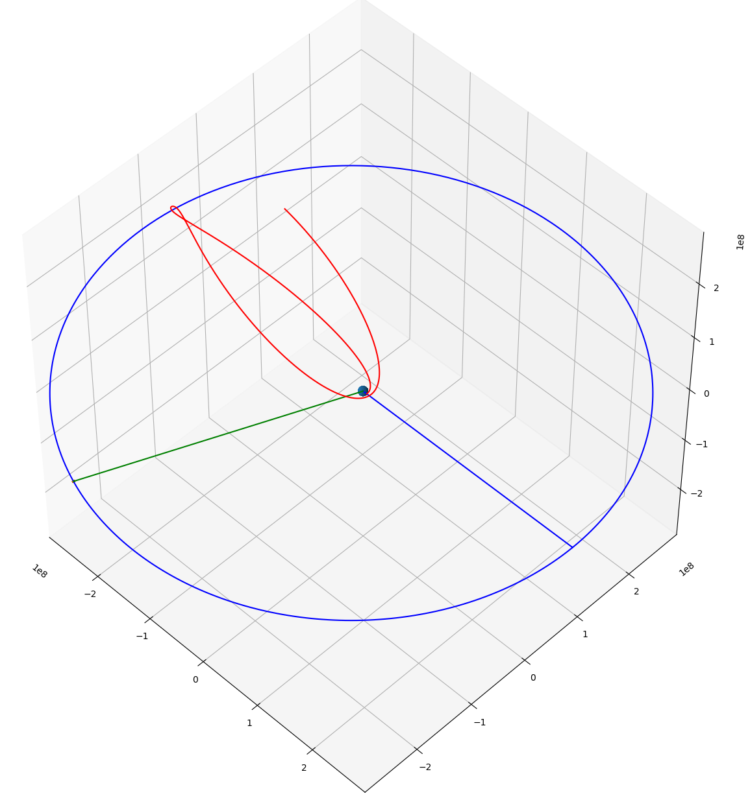

# n-body-orbit
N-Body orbit simulation with "on rails" bodies

## Design goals

The main purpose of this project is experimenting with n-body physics and orbital mechanics at real solar system scales.
I wanted to find a simple algorithm to stable realtime orbits with possibility to use fixed motion planets.


*Free return apollo style transfer trajectory with the moon*

## Features

- n-body physics
- fixed motion bodies (useful to reduce computation complexity)
- dynamic and fixed trajectories rendering
- multiple system configuration (sim.json)
- multiple simulation configuration (sim.json)
- spacecraft crash detection

## Setup and run the project
```
git clone https://github.com/thomasbechet/n-body-orbit.git
cd n-body-orbit
python nbody.py earth_moon_transfer
```
